# Manual Técnico: Sistema Distribuido "Black Friday"

**Universidad San Carlos de Guatemala**  
**Facultad de Ingeniería**  
**Ingeniería en Ciencias y Sistemas**  
**Sistemas Operativos 1**  
**Carnet:** 202300539  
**Nombre:** José Emanuel Monzón Lémus  
**Repositorio:** https://github.com/0520Jose/SO1_P2_202300539  
**Fecha:** Diciembre 2025

---

## Tabla de Contenidos

1. [Introducción](#1-introducción)
2. [Arquitectura del Sistema](#2-arquitectura-del-sistema)
    * [2.1 Diagrama de Flujo de Datos](#21-diagrama-de-flujo-de-datos)
    * [2.2 Tecnologías Implementadas](#22-tecnologías-implementadas)
3. [Descripción de Componentes y Deployments](#3-descripción-de-componentes-y-deployments)
    * [3.1. API de Entrada (Rust API)](#31-api-de-entrada-rust-api)
    * [3.2. Go Bridge (Intermediario)](#32-go-bridge-intermediario)
    * [3.3. Go Writer (Productor Kafka)](#33-go-writer-productor-kafka)
    * [3.4. Go Consumer (Procesador)](#34-go-consumer-procesador)
    * [3.5. Almacenamiento (Valkey DB)](#35-almacenamiento-valkey-db)
4. [Instrucciones de Despliegue](#4-instrucciones-de-despliegue)
    * [4.1. Prerrequisitos](#41-prerrequisitos)
    * [4.2. Despliegue de Infraestructura Base](#42-despliegue-de-infraestructura-base)
    * [4.3. Despliegue de Microservicios](#43-despliegue-de-microservicios)
    * [4.4. Configuración de Autoscaling](#44-configuración-de-autoscaling)
5. [Análisis de Rendimiento y Conclusiones](#5-análisis-de-rendimiento-y-conclusiones)
    * [5.1. Comparativa: API REST vs gRPC](#51-comparativa-api-rest-vs-grpc)
    * [5.2. Impacto de Kafka (Desacoplamiento)](#52-impacto-de-kafka-desacoplamiento)
    * [5.3. Persistencia en Valkey](#53-persistencia-en-valkey)
    * [5.4. Conclusión Final](#54-conclusión-final)

---

## 1. Introducción

El presente proyecto consiste en el diseño e implementación de una arquitectura de microservicios distribuida en la nube, orquestada con **Kubernetes** (MicroK8s). El sistema simula el procesamiento de un alto volumen de transacciones de ventas durante un evento de "Black Friday", aplicando conceptos de concurrencia, sistemas distribuidos y procesamiento en tiempo real.

El sistema integra múltiples lenguajes de programación (**Rust, Go, Python**) y tecnologías de infraestructura como **Apache Kafka** para mensajería asíncrona, **Valkey** (Redis) para almacenamiento en memoria de alta velocidad y **Grafana** para visualización de métricas.

---

## 2. Arquitectura del Sistema

El sistema sigue un flujo de datos lineal y desacoplado, diseñado para soportar alta carga sin perder información.

### 2.1 Diagrama de Flujo de Datos

1.  **Ingesta:** Tráfico generado por `Locust` $\rightarrow$ `Ingress NGINX` $\rightarrow$ `Rust API`.
2.  **Enrutamiento:** `Rust API` $\rightarrow$ `Go Bridge` (vía HTTP).
3.  **Transporte Interno:** `Go Bridge` $\rightarrow$ `Go Writer` (vía gRPC).
4.  **Cola de Mensajería:** `Go Writer` $\rightarrow$ `Apache Kafka` (Topic: `sales-topic`).
5.  **Procesamiento:** `Kafka` $\rightarrow$ `Go Consumer`.
6.  **Almacenamiento:** `Go Consumer` $\rightarrow$ `Valkey` (Persistencia en Disco).
7.  **Visualización:** `Valkey` $\rightarrow$ `Grafana Dashboard`.

### 2.2 Tecnologías Implementadas

| Componente | Tecnología | Rol |
| :--- | :--- | :--- |
| **Orquestador** | MicroK8s | Gestión del clúster de Kubernetes. |
| **Registry** | Zot | Almacenamiento privado de imágenes Docker. |
| **API Gateway** | Rust (Axum) | Recepción de tráfico de alta concurrencia. |
| **Middleware** | Go (Gin + gRPC) | Transformación y envío eficiente de datos. |
| **Mensajería** | Strimzi Kafka | Buffer asíncrono para desacoplar carga. |
| **Base de Datos** | Valkey (Redis) | Almacenamiento Key-Value en memoria con persistencia. |
| **Monitoreo** | Grafana | Visualización de KPIs en tiempo real. |

---

## 3. Descripción de Componentes y Deployments

Todos los componentes se despliegan en el namespace `black-friday`. A continuación se detallan las especificaciones técnicas.

### 3.1. API de Entrada (Rust API)
* **Función:** Puerta de enlace pública. Recibe JSONs de ventas y los valida.
* **Imagen:** `172.31.32.68:5000/rust-api:v2`
* **Escalabilidad (HPA):**
    * **Mínimo:** 1 réplica.
    * **Máximo:** 3 réplicas.
    * **Trigger:** Uso de CPU > 30%.
* **Comunicación:** Envía peticiones HTTP POST al servicio `go-bridge-service`.

```rust
use axum::{routing::post, Json, Router};
use serde::{Deserialize, Serialize};
use std::net::SocketAddr;

#[derive(Deserialize, Serialize, Debug)]
struct PurchaseInput {
    categoria: i32,
    producto_id: String,
    precio: f64,
    cantidad_vendida: i32,
}

#[derive(Serialize, Deserialize, Debug)]
struct BridgeResponse {
    estado: String,
}

#[derive(Serialize, Deserialize)]
struct StatusResponse {
    status: String,
}

async fn handle_purchase(Json(payload): Json<PurchaseInput>) -> Json<StatusResponse> {
    let bridge_url = "http://go-bridge-service:80";
    let client = reqwest::Client::new();

    let res = client
        .post(format!("{}/forward", bridge_url))
        .json(&payload)
        .send()
        .await;

    match res {
        Ok(response) => {
            if response.status().is_success() {
                match response.json::<BridgeResponse>().await {
                    Ok(bridge_res) => Json(StatusResponse {
                        status: bridge_res.estado,
                    }),
                    Err(_) => Json(StatusResponse {
                        status: "Decode Error".to_string(),
                    }),
                }
            } else {
                Json(StatusResponse {
                    status: "Bridge Error".to_string(),
                })
            }
        }
        Err(_) => Json(StatusResponse {
            status: "Connect Error".to_string(),
        }),
    }
}

#[tokio::main]
async fn main() {
    let app = Router::new().route("/purchase", post(handle_purchase));
    let addr = SocketAddr::from(([0, 0, 0, 0], 3000));
    let listener = tokio::net::TcpListener::bind(addr).await.unwrap();
    axum::serve(listener, app).await.unwrap();
}
```

### 3.2. Go Bridge (Intermediario)
* **Función:** Puente de traducción Protocolo. Convierte HTTP (Texto) a gRPC (Binario).
* **Imagen:** `172.31.32.68:5000/go-bridge:v1`
* **Escalabilidad (HPA):** 1 a 3 réplicas (CPU > 50%).
* **Recursos:** Límites de 300m CPU y 128Mi RAM para garantizar ligereza.

```go
package main

import (
	"context"
	"log"
	"net/http"
	"os"
	"time"

	"github.com/gin-gonic/gin"
	"google.golang.org/grpc"
	"google.golang.org/grpc/credentials/insecure"
	pb "go-bridge/pb"
)

type Venta struct {
	Categoria       int32   `json:"categoria"`
	ProductoID      string  `json:"producto_id"`
	Precio          float64 `json:"precio"`
	CantidadVendida int32   `json:"cantidad_vendida"`
}

func main() {
	grpcHost := os.Getenv("GRPC_HOST")
	if grpcHost == "" {
		grpcHost = "localhost:50051"
	}

	conn, err := grpc.NewClient(grpcHost, grpc.WithTransportCredentials(insecure.NewCredentials()))
	if err != nil {
		log.Fatalf("Fatal: %v", err)
	}
	defer conn.Close()
	client := pb.NewProductSaleServiceClient(conn)

	r := gin.Default()
	r.POST("/forward", func(c *gin.Context) {
		var v Venta
		if err := c.ShouldBindJSON(&v); err != nil {
			c.JSON(http.StatusBadRequest, gin.H{"error": err.Error()})
			return
		}

		ctx, cancel := context.WithTimeout(context.Background(), time.Second)
		defer cancel()

		res, err := client.ProcesarVenta(ctx, &pb.ProductSaleRequest{
			Categoria:       pb.CategoriaProducto(v.Categoria),
			ProductoId:      v.ProductoID,
			Precio:          v.Precio,
			CantidadVendida: v.CantidadVendida,
		})

		if err != nil {
			c.JSON(http.StatusInternalServerError, gin.H{"error": err.Error()})
			return
		}

		c.JSON(http.StatusOK, gin.H{"estado": res.Estado})
	})

	r.Run(":8080")
}
```

### 3.3. Go Writer (Productor Kafka)
* **Función:** Servidor gRPC que actúa como *Producer* para Kafka.
* **Imagen:** `172.31.32.68:5000/go-writer:v1`
* **Configuración:** Se realizaron pruebas de carga escalando manualmente a **2 réplicas** para verificar el balanceo de carga gRPC.
* **Kafka:** Conecta al bootstrap server `my-cluster-kafka-bootstrap.kafka.svc.cluster.local:9092`.

```go
package main

import (
	"context"
	"encoding/json"
	"log"
	"net"
	"os"
	"strings"

	pb "go-grpc-writer/pb"

	"github.com/IBM/sarama"
	"google.golang.org/grpc"
)

type server struct {
	pb.UnimplementedProductSaleServiceServer
	producer sarama.SyncProducer
}

func (s *server) ProcesarVenta(ctx context.Context, req *pb.ProductSaleRequest) (*pb.ProductSaleResponse, error) {
	msgBytes, err := json.Marshal(req)
	if err != nil {
		return &pb.ProductSaleResponse{Estado: "Error marshaling"}, nil
	}

	msg := &sarama.ProducerMessage{
		Topic: "sales-topic",
		Value: sarama.StringEncoder(msgBytes),
	}

	_, _, err = s.producer.SendMessage(msg)
	if err != nil {
		return &pb.ProductSaleResponse{Estado: "Error Kafka"}, nil
	}

	return &pb.ProductSaleResponse{Estado: "Procesado"}, nil
}

func main() {
	kafkaEnv := os.Getenv("KAFKA_BROKERS")
	if kafkaEnv == "" {
		kafkaEnv = "localhost:9092"
	}
	brokers := strings.Split(kafkaEnv, ",")

	config := sarama.NewConfig()
	config.Producer.Return.Successes = true
	config.Producer.RequiredAcks = sarama.WaitForAll
	
	producer, err := sarama.NewSyncProducer(brokers, config)
	if err != nil {
		log.Fatalf("Fatal Kafka: %v", err)
	}
	defer producer.Close()

	lis, err := net.Listen("tcp", ":50051")
	if err != nil {
		log.Fatalf("Fatal Listen: %v", err)
	}

	s := grpc.NewServer()
	pb.RegisterProductSaleServiceServer(s, &server{producer: producer})

	if err := s.Serve(lis); err != nil {
		log.Fatalf("Fatal Serve: %v", err)
	}
}
```

### 3.4. Go Consumer (Procesador)
* **Función:** *Consumer* del grupo `black-friday-group`. Lee mensajes, procesa estadísticas y escribe en DB.
* **Lógica de Negocio:**
    * Detecta productos "First-Seen" por categoría.
    * Calcula promedios y rankings en tiempo real.
    * Filtra métricas específicas para la categoría **Belleza** (Terminación de carnet 9).
* **Persistencia:** Escribe en Valkey usando comandos `SET`, `INCR`, `ZADD` y `XADD` (Streams).

```go
package main

import (
	"context"
	"encoding/json"
	"fmt"
	"log"
	"os"
	"os/signal"
	"strings"
	"sync"
	"syscall"
	"time"

	"github.com/IBM/sarama"
	"github.com/redis/go-redis/v9"
)
type Venta struct {
	Categoria       int32   `json:"categoria"`
	ProductoID      string  `json:"producto_id"`
	Precio          float64 `json:"precio"`
	CantidadVendida int32   `json:"cantidad_vendida"`
}

var categorias = map[int32]string{
	1: "Electronica", 2: "Ropa", 3: "Hogar", 4: "Belleza",
}

type Consumer struct {
	rdb *redis.Client
}

func (consumer *Consumer) Setup(sarama.ConsumerGroupSession) error { return nil }

func (consumer *Consumer) Cleanup(sarama.ConsumerGroupSession) error { return nil }

func (consumer *Consumer) ConsumeClaim(session sarama.ConsumerGroupSession, claim sarama.ConsumerGroupClaim) error {
	for message := range claim.Messages() {
		procesarMensaje(session.Context(), consumer.rdb, message.Value)
		session.MarkMessage(message, "")
	}
	return nil
}

func main() {
	valkeyAddr := os.Getenv("VALKEY_ADDR")
	if valkeyAddr == "" { valkeyAddr = "localhost:6379" }
	
	kafkaEnv := os.Getenv("KAFKA_BROKERS")
	if kafkaEnv == "" { kafkaEnv = "localhost:9092" }
	brokers := strings.Split(kafkaEnv, ",")

	rdb := redis.NewClient(&redis.Options{Addr: valkeyAddr})

	config := sarama.NewConfig()
	config.Consumer.Return.Errors = true
	config.Consumer.Offsets.Initial = sarama.OffsetOldest
	config.Consumer.Group.Rebalance.Strategy = sarama.NewBalanceStrategyRoundRobin()

	groupName := "black-friday-group"
	consumerGroup, err := sarama.NewConsumerGroup(brokers, groupName, config)
	if err != nil {
		log.Fatalf("Error creando consumer group: %v", err)
	}
	defer consumerGroup.Close()

	ctx, cancel := context.WithCancel(context.Background())
	consumer := &Consumer{rdb: rdb}

	wg := &sync.WaitGroup{}
	wg.Add(1)

	go func() {
		defer wg.Done()
		for {
			if err := consumerGroup.Consume(ctx, []string{"sales-topic"}, consumer); err != nil {
				log.Printf("Error en consumer: %v", err)
			}
			if ctx.Err() != nil {
				return
			}
		}
	}()

	log.Println("Consumidor (Group) Iniciado")

	sigterm := make(chan os.Signal, 1)
	signal.Notify(sigterm, syscall.SIGINT, syscall.SIGTERM)
	<-sigterm
	log.Println("Terminando consumidor")
	cancel()
	wg.Wait()
}

func procesarMensaje(ctx context.Context, rdb *redis.Client, value []byte) {
	var venta Venta
	if err := json.Unmarshal(value, &venta); err != nil {
		return
	}

	nombreCat, existe := categorias[venta.Categoria]
	if !existe {
		nombreCat = "Otros"
	}

	keyMonitoredName := fmt.Sprintf("producto_monitoreado_nombre:%s", nombreCat)
	
	seAsigno, _ := rdb.SetNX(ctx, keyMonitoredName, venta.ProductoID, 0).Result()
	if seAsigno {
		log.Printf("ELEGIDO para %s: %s", nombreCat, venta.ProductoID)
	}

	productoElegido, _ := rdb.Get(ctx, keyMonitoredName).Result()

	if venta.ProductoID == productoElegido {
		keyStreamUnico := fmt.Sprintf("stream_precio_producto_unico:%s", nombreCat)
		rdb.XAdd(ctx, &redis.XAddArgs{
			Stream: keyStreamUnico,
			MaxLen: 1000, 
			Values: map[string]interface{}{
				"precio": venta.Precio,
			},
		})
	}

	keyContador := fmt.Sprintf("contador:%s", nombreCat)
	keySumaCantidad := fmt.Sprintf("suma_cantidad:%s", nombreCat)
	keySumaPrecio := fmt.Sprintf("suma_precio:%s", nombreCat)
	
	nuevoContador, _ := rdb.Incr(ctx, keyContador).Result()
	nuevaSumaCant, _ := rdb.IncrBy(ctx, keySumaCantidad, int64(venta.CantidadVendida)).Result()
	nuevaSumaPrecio, _ := rdb.IncrByFloat(ctx, keySumaPrecio, venta.Precio).Result()

	if nuevoContador > 0 {
		promProd := float64(nuevaSumaCant) / float64(nuevoContador)
		rdb.Set(ctx, fmt.Sprintf("promedio_productos:%s", nombreCat), promProd, 0)

		promPrecio := nuevaSumaPrecio / float64(nuevoContador)
		rdb.Set(ctx, fmt.Sprintf("promedio_precio_tag:%s", nombreCat), promPrecio, 0)
	}

	rdb.Incr(ctx, "total_ventas")
	rdb.ZIncrBy(ctx, "ranking_productos", float64(venta.CantidadVendida), venta.ProductoID)
	rdb.ZIncrBy(ctx, fmt.Sprintf("ranking_productos_cat:%s", nombreCat), float64(venta.CantidadVendida), venta.ProductoID)

	currentMax, _ := rdb.Get(ctx, "precio_max_global").Float64()
	if venta.Precio > currentMax {
		rdb.Set(ctx, "precio_max_global", venta.Precio, 0)
	}
	
	currentMin, err := rdb.Get(ctx, "precio_min_global").Float64()
	if err == redis.Nil || venta.Precio < currentMin {
		rdb.Set(ctx, "precio_min_global", venta.Precio, 0)
	}
}
```

### 3.5. Almacenamiento (Valkey DB)
* **Tipo:** Deployment con **Persistencia de Datos**.
* **Réplicas:** **2 réplicas** fijas (Requisito de alta disponibilidad).
* **Storage:** Utiliza un `PersistentVolumeClaim` (PVC) de 1Gi montado en `/data`. Esto asegura que los datos sobrevivan al reinicio o eliminación de los Pods.

---

## 4. Instrucciones de Despliegue

Siga estos pasos para levantar la infraestructura desde cero en un clúster MicroK8s limpio.

### 4.1. Prerrequisitos
* MicroK8s instalado y corriendo.
* Addons habilitados: `dns`, `storage`, `ingress`.
* Acceso al Registry privado Zot (`172.31.32.68:5000`).

### 4.2. Despliegue de Infraestructura Base
Desplegar primero los componentes de soporte (Kafka y Base de Datos).

```bash
# 1. Crear Cluster de Kafka (Strimzi)

apiVersion: kafka.strimzi.io/v1beta2
kind: KafkaNodePool
metadata:
  name: dual-role
  labels:
    strimzi.io/cluster: my-cluster
  namespace: kafka
spec:
  replicas: 1
  roles:
    - controller
    - broker
  storage:
    type: ephemeral
---
apiVersion: kafka.strimzi.io/v1beta2
kind: Kafka
metadata:
  name: my-cluster
  namespace: kafka
  annotations:
    strimzi.io/node-pools: enabled
    strimzi.io/kraft: enabled
spec:
  kafka:
    version: 3.7.0
    metadataVersion: 3.7-IV4
    listeners:
      - name: plain
        port: 9092
        type: internal
        tls: false
    config:
      offsets.topic.replication.factor: 1
      transaction.state.log.replication.factor: 1
      transaction.state.log.min.isr: 1
      default.replication.factor: 1
      min.insync.replicas: 1
  entityOperator:
    topicOperator: {}
    userOperator: {}

Comando: kubectl apply -f k8s/infra/kafka-cluster.yaml

# 2. Desplegar Valkey con Persistencia

apiVersion: v1
kind: Namespace
metadata:
  name: black-friday
---
apiVersion: apps/v1
kind: Deployment
metadata:
  name: valkey
  namespace: black-friday
spec:
  replicas: 1
  selector:
    matchLabels:
      app: valkey
  template:
    metadata:
      labels:
        app: valkey
    spec:
      containers:
      - name: valkey
        image: valkey/valkey:7.2
        ports:
        - containerPort: 6379
---
apiVersion: v1
kind: Service
metadata:
  name: valkey-service
  namespace: black-friday
spec:
  selector:
    app: valkey
  ports:
    - protocol: TCP
      port: 6379
      targetPort: 6379

Comando: kubectl apply -f k8s/infra/valkey.yaml
```

### 4.3. Despliegue de Microservicios
Desplegar las aplicaciones de negocio apuntando al registry privado.

```bash
# Definir IP del Registry
export ZOT_IP="172.31.32.68"

# Inyectar IP y aplicar manifiestos

# --- GO WRITER ---
apiVersion: apps/v1
kind: Deployment
metadata:
  name: go-writer
  namespace: black-friday
spec:
  replicas: 1
  selector:
    matchLabels:
      app: go-writer
  template:
    metadata:
      labels:
        app: go-writer
    spec:
      containers:
      - name: go-writer
        image: 172.31.32.68:5000/go-writer:v1
        ports:
        - containerPort: 50051
        env:
        - name: KAFKA_BROKERS
          value: "my-cluster-kafka-bootstrap.kafka.svc.cluster.local:9092"
---
apiVersion: v1
kind: Service
metadata:
  name: go-writer-service
  namespace: black-friday
spec:
  type: ClusterIP
  selector:
    app: go-writer
  ports:
    - port: 50051
      targetPort: 50051

# --- GO BRIDGE ---
---
apiVersion: apps/v1
kind: Deployment
metadata:
  name: go-bridge
  namespace: black-friday
spec:
  selector:
    matchLabels:
      app: go-bridge
  template:
    metadata:
      labels:
        app: go-bridge
    spec:
      containers:
      - name: go-bridge
        image: 172.31.32.68:5000/go-bridge:v1
        ports:
        - containerPort: 8080
        env:
        - name: GRPC_HOST
          value: "go-writer-service:50051"
        resources:
          requests:
            cpu: "100m"
            memory: "64Mi"
          limits:
            cpu: "300m"
            memory: "128Mi"

# --- GO CONSUMER ---
---
apiVersion: apps/v1
kind: Deployment
metadata:
  name: go-consumer
  namespace: black-friday
spec:
  selector:
    matchLabels:
      app: go-consumer
  template:
    metadata:
      labels:
        app: go-consumer
    spec:
      containers:
      - name: go-consumer
        image: 172.31.32.68:5000/go-consumer:v9
        env:
        - name: KAFKA_BROKERS
          value: "my-cluster-kafka-bootstrap.kafka.svc.cluster.local:9092"
        - name: VALKEY_ADDR
          value: "valkey-service.black-friday.svc:6379"
        resources:
          requests:
            cpu: "100m"
            memory: "64Mi"
          limits:
            cpu: "300m"
            memory: "256Mi"

# --- RUST API ---
---
apiVersion: apps/v1
kind: Deployment
metadata:
  name: rust-api
  namespace: black-friday
spec:
  selector:
    matchLabels:
      app: rust-api
  template:
    metadata:
      labels:
        app: rust-api
    spec:
      containers:
      - name: rust-api
        image: 172.31.32.68:5000/rust-api:v2
        ports:
        - containerPort: 3000
        resources:
          requests:
            cpu: "150m"
            memory: "128Mi"
          limits:
            cpu: "500m"
            memory: "512Mi"

# --- GRAFANA ---
apiVersion: v1
kind: PersistentVolumeClaim
metadata:
  name: grafana-pvc
  namespace: black-friday
spec:
  accessModes:
    - ReadWriteOnce
  resources:
    requests:
      storage: 1Gi
---
# --- DEPLOYMENT GRAFANA ---
apiVersion: apps/v1
kind: Deployment
metadata:
  name: grafana
  namespace: black-friday
spec:
  replicas: 1
  selector:
    matchLabels:
      app: grafana
  template:
    metadata:
      labels:
        app: grafana
    spec:
      containers:
      - name: grafana
        image: grafana/grafana:latest
        ports:
        - containerPort: 3000
        env:
        - name: GF_SECURITY_ADMIN_PASSWORD
          value: "admin"
        - name: GF_INSTALL_PLUGINS
          value: "redis-datasource"
        volumeMounts:
        - mountPath: "/var/lib/grafana"
          name: grafana-storage
      volumes:
      - name: grafana-storage
        persistentVolumeClaim:
          claimName: grafana-pvc
---
apiVersion: v1
kind: Service
metadata:
  name: grafana-service
  namespace: black-friday
spec:
  type: NodePort
  selector:
    app: grafana
  ports:
    - port: 3000
      targetPort: 3000
      nodePort: 32000
      nodePort: 32000

# --- INGRESS ---
---
apiVersion: networking.k8s.io/v1
kind: Ingress
metadata:
  name: rust-api-ingress
  namespace: black-friday
spec:
  ingressClassName: public
  rules:
  - http:
      paths:
      - path: /purchase
        pathType: Prefix
        backend:
          service:
            name: rust-api-service
            port:
              number: 80

sed "s|image: .*5000/|image: $ZOT_IP:5000/|g" k8s/deploy-system.yaml | kubectl apply -f -
```

### 4.4. Configuracion de Autoscaling
Activar los Horizontal Pod Autoscales

```bash

apiVersion: autoscaling/v1
kind: HorizontalPodAutoscaler
metadata:
  name: rust-api-hpa
  namespace: black-friday
spec:
  scaleTargetRef:
    apiVersion: apps/v1
    kind: Deployment
    name: rust-api
  minReplicas: 1
  maxReplicas: 3
  targetCPUUtilizationPercentage: 30

---
apiVersion: autoscaling/v1
kind: HorizontalPodAutoscaler
metadata:
  name: go-bridge-hpa
  namespace: black-friday
spec:
  scaleTargetRef:
    apiVersion: apps/v1
    kind: Deployment
    name: go-bridge
  minReplicas: 1
  maxReplicas: 3
  targetCPUUtilizationPercentage: 50

---
apiVersion: autoscaling/v1
kind: HorizontalPodAutoscaler
metadata:
  name: go-consumer-hpa
  namespace: black-friday
spec:
  scaleTargetRef:
    apiVersion: apps/v1
    kind: Deployment
    name: go-consumer
  minReplicas: 1
  maxReplicas: 2
  targetCPUUtilizationPercentage: 50

kubectl apply -f k8s/hpa.yaml
```

## 5. Análisis de Rendimiento y Conclusiones

### Pruebas de Escalabilidad (HPA en Rust)

- Estado inicial  
   Locust apagado
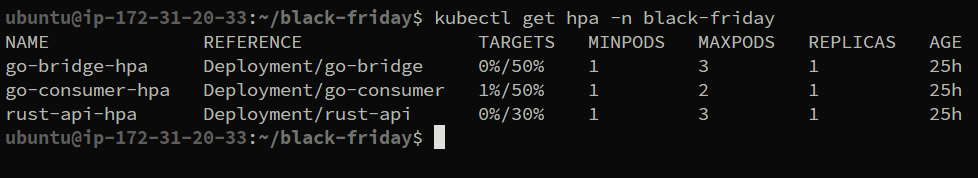

- Estado de trabajo con 10 usuarios  
   Locust con poca carga  
   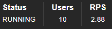

   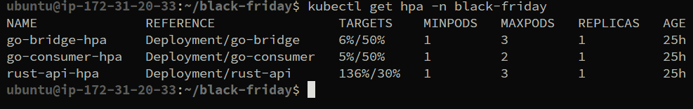

- Estado de trabajo con 100 usuarios  
   Locus con alta carga  
   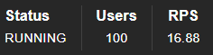

   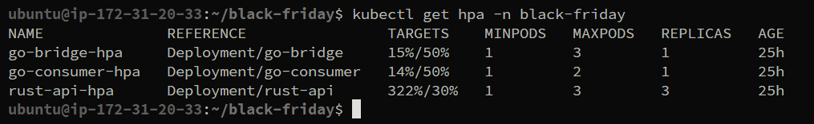

### Prubeas de impacto en replicas en Valkey

En primer lugar se realizo pruebas con solo una replica, por lo que el sistema se configura a una replica.  

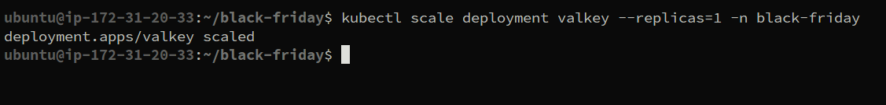

En grafana la visualización de los datos es normal. 
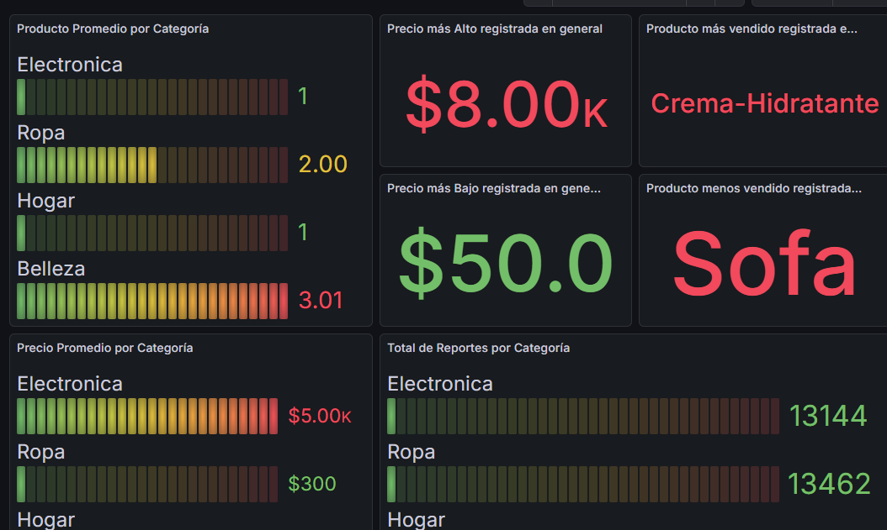

Segunda prueba realizada con dos replicas, sistema configurado para dos replicas.  

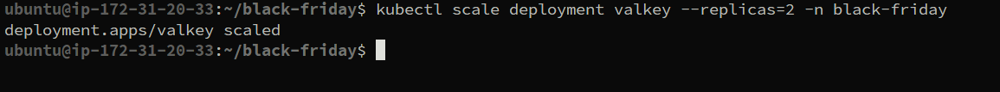

En grafana la visualización de los datos sigue siendo eficiente pero en algunas ocaciones se producen fallos al mostrar datos.

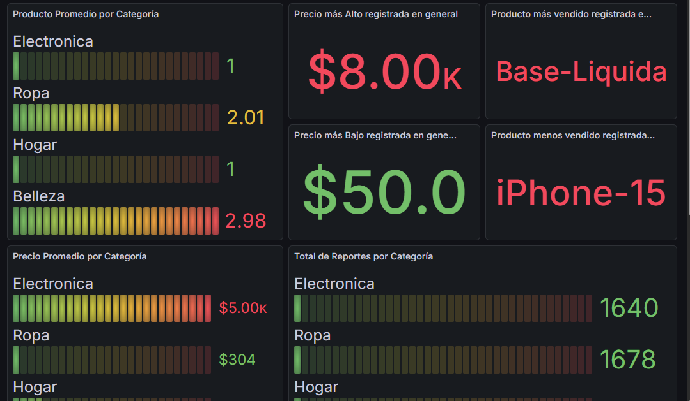

### Escalado de Writers (gRPC)

En primer lugar se realizó una prueba solo con una replica. Sistema configurado a una replica.

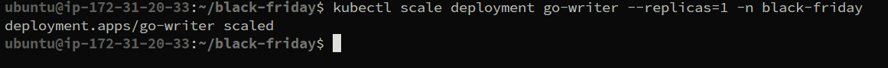

El sistema distribuye la carga sobre la unica replica.

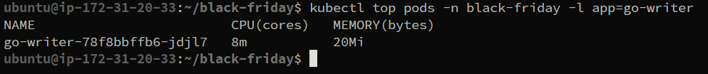

Segunda prueba realizada con dos replicas. Sistema configurado a dos replicas.

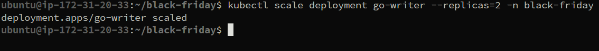

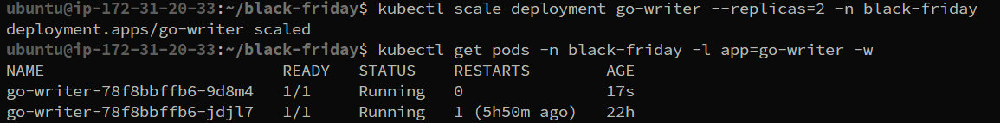

El sistema la asigna los recursos de manera que no se sature alguna de las replicas.

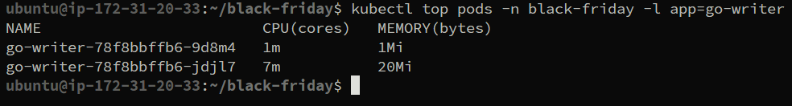


### Comparacion de consumno de recursos

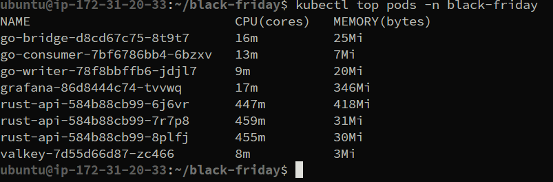

Como vemos el consumo de go-writer es minimo que esta usando gRPC apenas 8m de los cores del CPU mientras que el rust-api con las 3 replicas usa  cada una un promedio de 455m cores de CPU siendo que esta usa una API REST demuestra las ventajas que permite gRPC.

### 5.4. Conclusión Final
Se comprobó que la arquitectura funciona correctamente, garantizando que el sistema esté siempre disponible y pueda crecer según la demanda. El mecanismo de autoescalado (HPA) ajusta los recursos automáticamente ante los cambios en el tráfico de procesamiento actual. Además, al separar las tareas de recepción y procesamiento, se evita que un fallo en un solo punto detuviera la entrada de datos, haciendo el sistema mucho más resistente.